# ⚓ PortMaster - Akıllı Liman Yönetim ve Otomasyon Sistemi

PortMaster, modern liman işletmelerinin konteyner operasyonlarını, rıhtım yanaşma planlarını, kapı giriş-çıkış rezervasyonlarını, gümrük denetimlerini ve mali raporlamalarını tek bir merkezden yöneten **akıllı bir liman otomasyon ve yönetim sistemi** projesidir.

Proje, **Mikro-Servis benzeri ikili API yapısı** (.NET 8 Web API + Dapper & EF Core) ve **Zenginleştirilmiş React Arayüzü** ile hem yüksek performanslı okuma/raporlama işlemlerini hem de güvenli veri yazma süreçlerini sunmaktadır.

---

## 📸 Proje Ekran Görüntüleri

Aşağıda PortMaster yönetim panelinin modüllerine ve gelişmiş kullanıcı arayüzüne ait ekran görüntüleri yer almaktadır:

| 🖥️ Gösterge Paneli (Dashboard) & Rıhtım Planı | 🏗️ Konteyner Yönetim Ekranı |
|:---:|:---:|
| 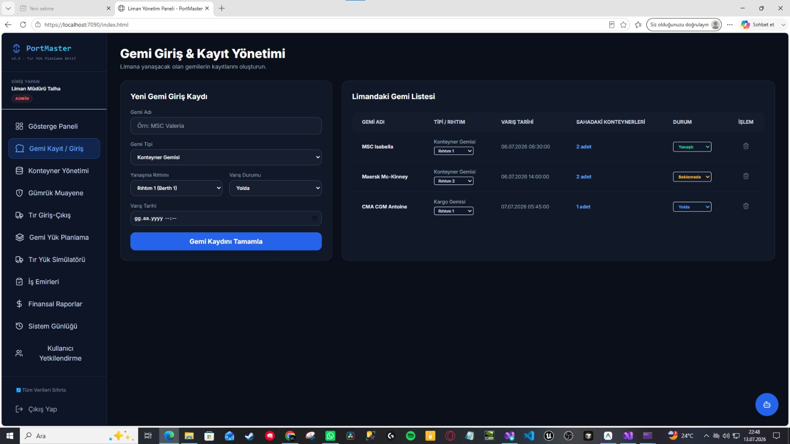 | 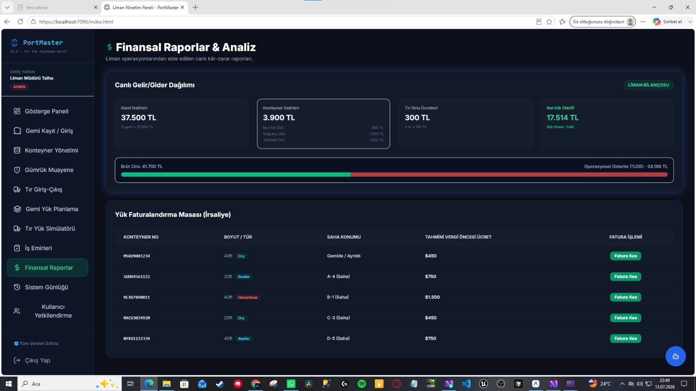 |

| 🛡️ Gümrük Muayene ve Denetim | 🚚 Tır Kapısı Giriş-Çıkış Simülatörü |
|:---:|:---:|
| 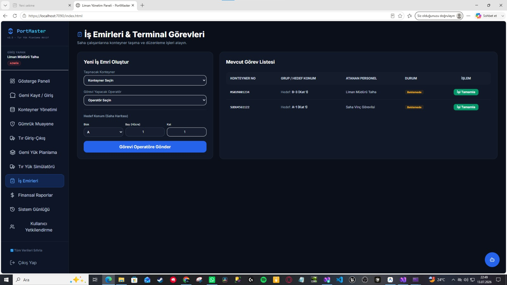 | 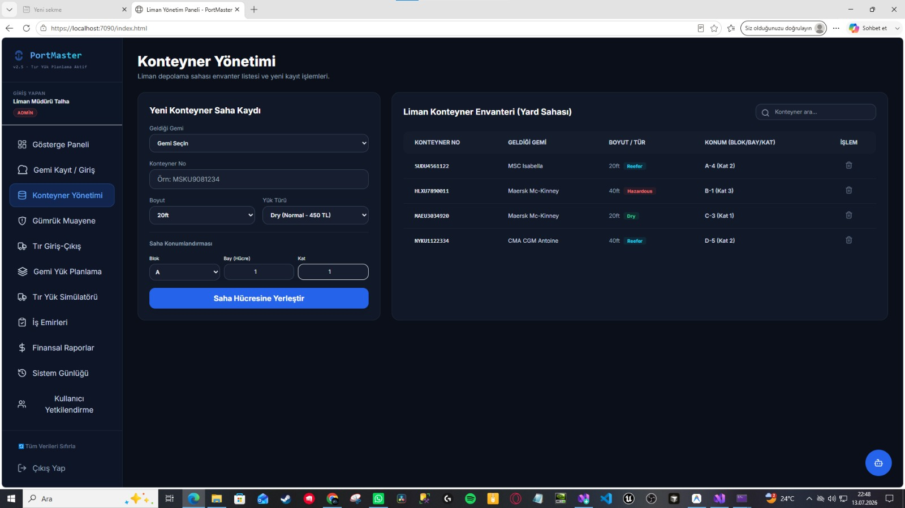 |

| 🗺️ İnteraktif Saha Planlama (Yard Map) | 🤖 Yapay Zeka Liman Asistanı (AI Chat) |
|:---:|:---:|
| 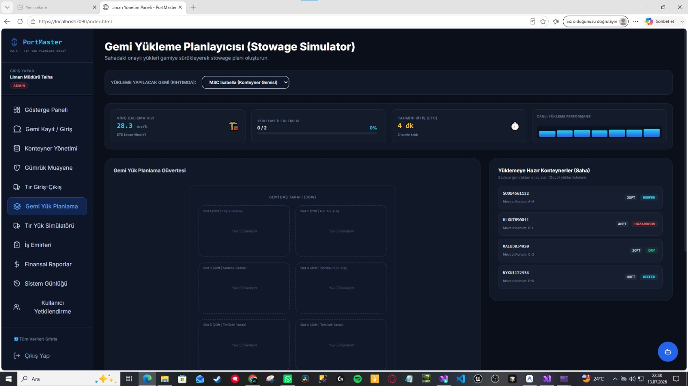 | 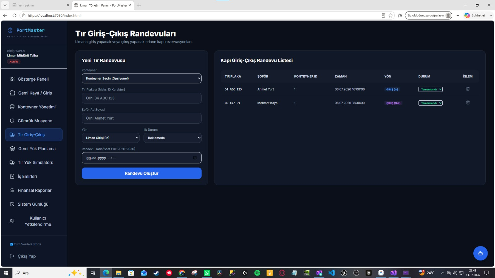 |

| 📄 İş Emirleri & Görev Takibi | 💰 Finansal Raporlar & Fatura İhracı |
|:---:|:---:|
| 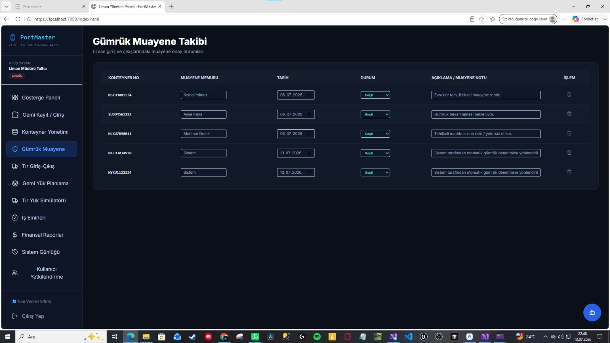 | 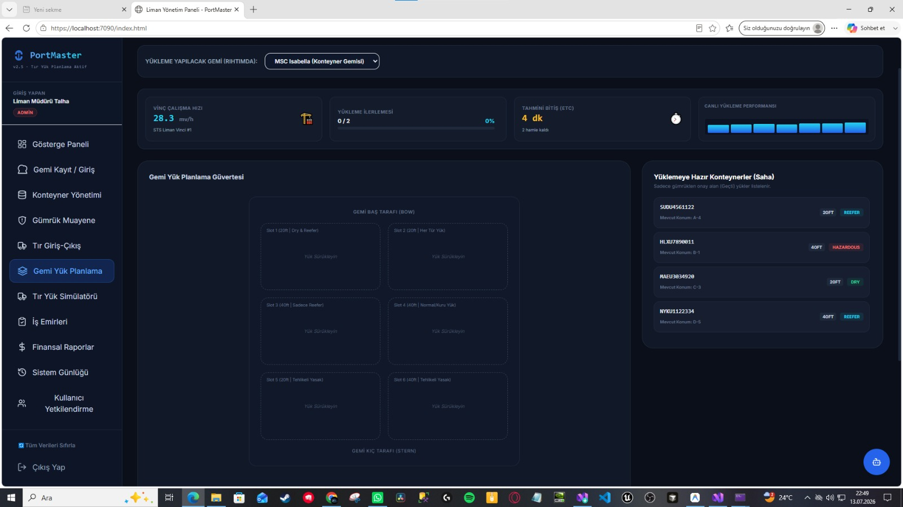 |

| 🔍 Sistem Günlüğü (Audit Logs) | 🔐 Kullanıcı Yetkilendirme & Giriş |
|:---:|:---:|
| 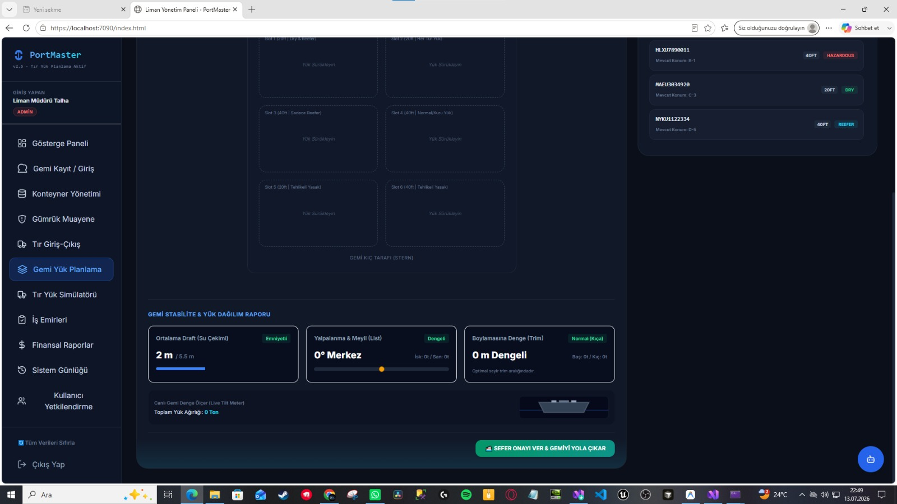 | 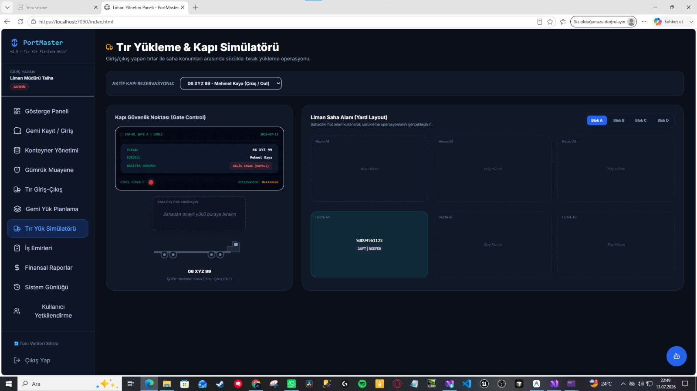 |

| 📊 Excel / PDF Raporlama Servisi | ⚓ Rıhtım Detay & Gemi Hareketleri |
|:---:|:---:|
| 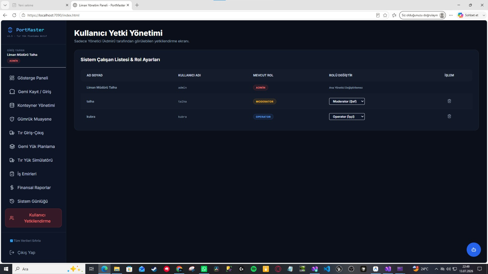 | 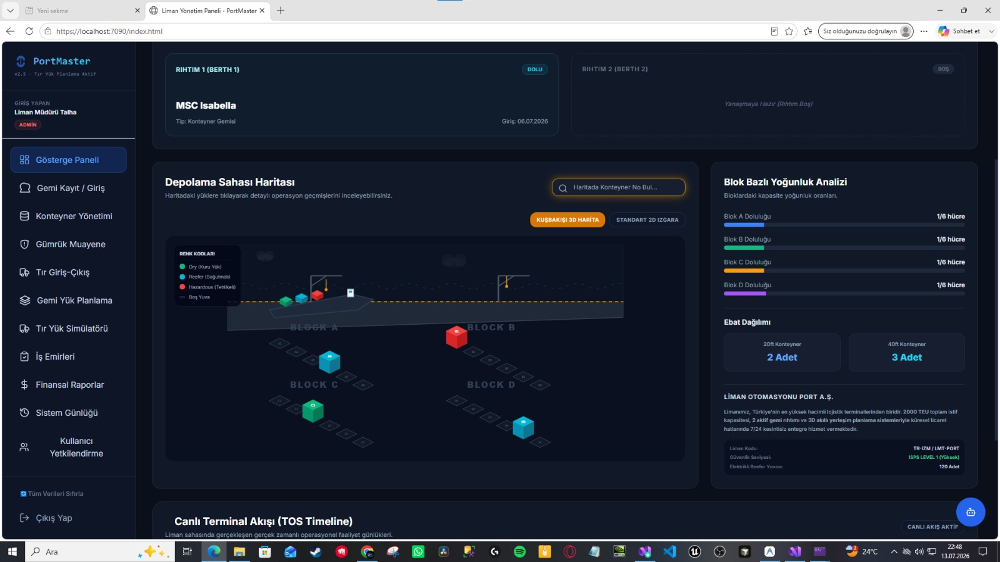 |

---

## 🚀 Öne Çıkan Özellikler ve Modüller

1. **Gösterge Paneli (Real-time Dashboard):**
   - Anlık rüzgar hızı (Knot) ve fırtına modu kontrolü.
   - Saha doluluk oranları (TEU bazında görsel grafik).
   - Limanda yanaşmış durumdaki aktif gemi sayıları ve kapı hareket istatistikleri.

2. **Rıhtım Yanaşma Planı (Berth Plan):**
   - Rıhtımların (Berth 1 / Berth 2) canlı doluluk durumları.
   - Yanaşan gemilerin yük türü, tonaj ve operasyonel durum gösterimleri.

3. **Konteyner Yönetimi (Container Registry):**
   - Konteynerlerin detaylı kayıt, güncelleme ve silme işlemleri.
   - Tehlikeli (Hazardous), Soğutuculu (Reefer) ve Standart yük türü ayrımı.

4. **Gümrük Muayene ve Geçiş Kontrolü (Customs Inspection):**
   - Limana giren yüklerin gümrük onay durumları.
   - Geçti / Kaldı / Beklemede durum kontrolleri.

5. **İnteraktif Sürükle-Bırak Saha Planlaması (Drag-and-Drop Yard Map):**
   - Kapıda bekleyen aktif tır rezervasyonlarından yükü sürükleyip liman saha bloklarına (A, B, C, D blokları) yerleştirme simülasyonu.
   - Çıkış yapacak tırlara sahadan yük yükleyip liman çıkışını tamamlama.
   - İşlem sonunda otomatik **Termal Kapı Geçiş Fişi (Gate Pass Receipt)** üretimi ve yazdırılması.

6. **Yapay Zeka Destekli Liman Asistanı (AI Agent Chatbot):**
   - Liman operatörlerine yardımcı olan, konteyner sorgulamaları yapabilen entegre LLM sohbet asistanı.

7. **Gelişmiş Raporlama & Fatura Üretimi:**
   - Gemilerin yük ve liman kullanım detaylarını **Excel formatında dışa aktarma**.
   - Finansal faturaları **PDF formatında** dinamik şablonla indirme yeteneği.

---

## 🛠️ Kullanılan Teknolojiler

### Backend (.NET 8)
- **ASP.NET Core Web API:** Yazma ve okuma mikro-servisleri.
- **Entity Framework Core (EF Core):** İlişkisel veri modeli yönetimi ve SQLite entegrasyonu.
- **Dapper:** Performans odaklı, ham SQL sorgularıyla çalışan hızlı gösterge paneli ve rapor okuma katmanı.
- **SQLite Database:** Taşınabilir, hızlı ve konfigürasyon gerektirmeyen veri tabanı motoru.
- **JWT (JSON Web Token) Bearer:** Güvenli kullanıcı kimlik doğrulama ve rol yetkilendirme.
- **EPPlus & PDF Generator:** Excel ve PDF dinamik belge oluşturma servisleri.
- **Serilog:** Günlükleme (Logging) altyapısı.

### Frontend (React & Tailwind)
- **React.js (v18):** Bileşen tabanlı dinamik arayüz yönetimi.
- **Tailwind CSS:** Modern, responsive ve karanlık mod odaklı premium tasarım tasarımı.
- **Marked.js:** Yapay zeka asistanından gelen markdown yanıtlarını görselleştirme.
- **Local Asset Hosting:** İnternet erişimi kısıtlı bilgisayarlarda dahi arayüzün anında ve sıfır gecikmeyle açılması için tüm kütüphaneler (Tailwind, React, Babel, Marked) yerel olarak `wwwroot` içerisinde barındırılmaktadır.

---

## 📂 Proje Katmanları ve Mimari Yapısı

```
📂 BitirmeProjesiLiman (Solution)
├── 📁 BitirmeProjesiLiman.Core         # Varlıklar (Entities), DTO'lar ve Repository Arayüzleri
├── 📁 BitirmeProjesiLiman.Data.EF     # EF Core DbContext, Repository İmplementasyonu ve Veri Tohumlama (Seed Data)
├── 📁 BitirmeProjesiLiman.Data.Dapper # Dapper Bağlantı Fabrikası ve Hızlı Rapor Repository Sorguları
├── 📁 BitirmeProjesiLiman.Service     # Excel/PDF İhracat, Caching (Önbellek) ve AI Entegrasyon Servisleri
├── 📁 BitirmeProjesiLiman.EF.API      # EF Tabanlı Yazma API Servisi + React Arayüzü (wwwroot/index.html)
└── 📁 BitirmeProjesiLiman.Dapper.API  # Dapper Tabanlı Hızlı Okuma/Raporlama API Servisi
```

---

## ⚙️ Kurulum ve Çalıştırma

### Gereksinimler
- .NET 8 SDK veya üzeri
- Visual Studio 2022 / 2026 (Community veya Professional) ya da VS Code

### Adımlar

1. **Çözümü Visual Studio'da Açın:**
   `BitirmeProjesiLiman.slnx` veya çözüm klasörünü Visual Studio ile açın.

2. **Başlangıç Projelerini Ayarlayın (Multiple Startup Projects):**
   - Çözüme (Solution) sağ tıklayıp **Özellikler (Properties)** seçeneğine gidin.
   - **Birden çok başlatma projesi (Multiple Startup Projects)** seçeneğini işaretleyin.
   - `BitirmeProjesiLiman.EF.API` projesini **Başlat (Start)** yapın.
   - `BitirmeProjesiLiman.Dapper.API` projesini **Başlat (Start)** yapın.
   - Değişiklikleri kaydedip kapatın.

3. **Projeyi Derleyin ve Çalıştırın:**
   - Üst menüden **Temizle (Clean)** yapıp **Yeniden Derle (Rebuild)** seçin.
   - **F5** tuşuna basarak projeyi başlatın.

4. **Arayüze Bağlanın:**
   - Tarayıcınız otomatik olarak açılacak ve sizi doğrudan **`https://localhost:7090/index.html`** adresindeki PortMaster arayüzüne bağlayacaktır.
